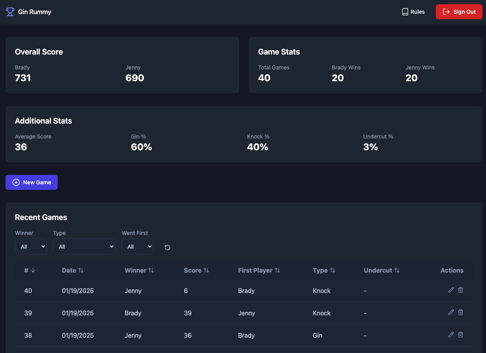
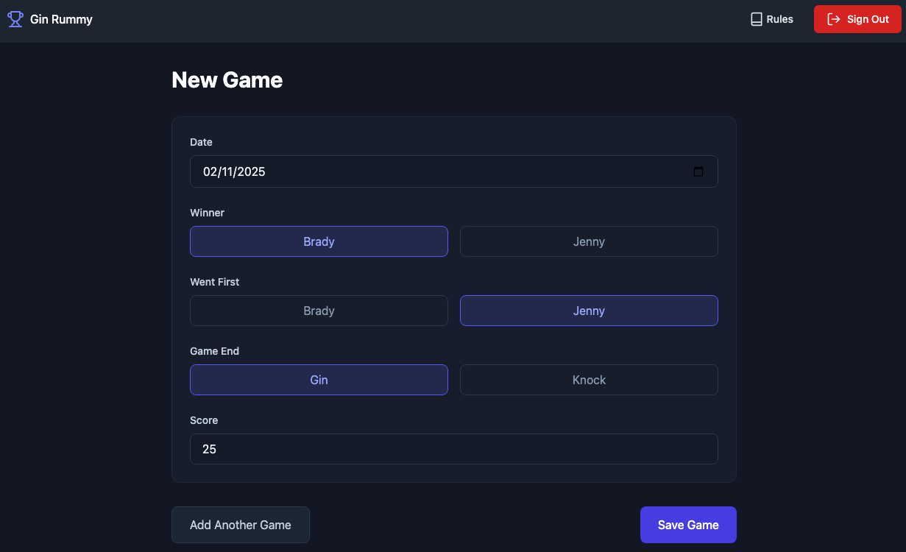

# 🃏 Gin Tracker

## Overview
Gin Tracker is a **web application for tracking Gin Rummy games** between two players (**Brady and Jenny**) with **real-time score updates**.

### Features:
- **Score Tracking:** Log and view Gin Rummy scores in a structured table.
- **Game History & Statistics:** Track past games and calculate player statistics.
- **Authentication:** Google OAuth with **email restrictions** for secure access.
- **Offline Support:** IndexedDB for **offline storage** & Service Worker for offline access.
- **Responsive Design:** Dark mode and mobile support for seamless usability.

---

## 📸 Screenshots

### Games Page
This is the main dashboard where users can view previous Gin Rummy games, complete with scores, filters, and statistics.

### New Game Setup
This page allows users to log a new Gin Rummy game by entering the game type and winner details.

---

## 🛠 Tech Stack
- **Frontend:** React 18 (TypeScript), Vite, Tailwind CSS
- **Backend:** Supabase (PostgreSQL), Google OAuth
- **Authentication:** Supabase Auth, Google OAuth
- **Storage:** IndexedDB (via `idb`)
- **Routing & UI:** React Router, Lucide React (icons)
- **Offline Functionality:** Service Workers, IndexedDB

---

## 🔧 Setup & Configuration

### 📌 **GitHub Setup**
- **Repository:** [gin-tracker](https://github.com/bradyespey/gin-tracker)
- **Local Directory:** `/Users/bradyespey/Projects/GinTracker`

### 🌐 **Google OAuth (GCP)**
- **Authorized Scopes:**
  - `./auth/userinfo.email`
  - `./auth/userinfo.profile`
  - `openid`
- **Allowed JavaScript Origins:**
  - `https://gintracker.netlify.app`
  - `https://db_path.supabase.co`
- **Redirect URLs:**
  - `https://db_path.supabase.co/auth/v1/callback`
  - `https://gintracker.netlify.app/auth/callback`
- **Restricted Emails (via environment variables):**
  - `user1@gmail.com`
  - `user2@gmail.com`
  - `user3@gmail.com`

### 🗄 **Supabase Configuration**
- **Project ID:** `project_id`
- **Database:** PostgreSQL (Games Table)
- **Google OAuth Authentication:**
  - Google Client ID & Secret configured in Supabase Auth.
  - **Site URL:** `https://gintracker.netlify.app`
  - **Redirect URL:** `https://gintracker.netlify.app/auth/callback`

### 🚀 **Netlify Deployment**
- **Live URL:** [gintracker.netlify.app](https://gintracker.netlify.app/)
- **Connected to GitHub repo:** `gin-tracker`
- **Environment Variables Configured:**
  - `VITE_ALLOWED_EMAILS`
  - `VITE_SUPABASE_ANON_KEY`
  - `VITE_SUPABASE_URL`

---

## 📂 Codebase Structure

### 🌍 **Root Configuration**
| File                     | Description |
|--------------------------|-------------|
| `package.json`           | Project dependencies and npm scripts |
| `vite.config.ts`         | Vite bundler configuration |
| `tsconfig.json`          | TypeScript settings |
| `eslint.config.js`       | ESLint rules for code consistency |
| `postcss.config.js`      | Tailwind/PostCSS configuration |
| `tailwind.config.js`     | Tailwind customization |
| `netlify.toml`           | Netlify deployment settings |
| `index.html`             | Main HTML entry point |

### 📁 **Source Code (`src/`)**
#### 🏗 **Core Files**
| File                     | Description |
|--------------------------|-------------|
| `App.tsx`                | Root React component, theme handling |
| `main.tsx`               | Application entry point, service worker registration |
| `index.css`              | Global styles (Tailwind) |
| `vite-env.d.ts`          | Type declarations for Vite |

#### 📦 **Components (`src/components/`)**
| File                     | Description |
|--------------------------|-------------|
| `AuthButton.tsx`         | Google Sign-in/Sign-out button |
| `EditGameModal.tsx`      | Edit game modal |
| `GameActions.tsx`        | Buttons for edit/delete actions |
| `GameList.tsx`           | Table for displaying games (sorting & pagination) |
| `Pagination.tsx`         | Pagination controls |

#### 🔑 **Authentication & Hooks**
| File                     | Description |
|--------------------------|-------------|
| `AuthContext.tsx`        | Auth state management (Google OAuth) |
| `usePagination.ts`       | Custom hook for pagination |
| `useSortedGames.ts`      | Hook for game sorting |

#### 🔗 **Services (`src/services/`)**
| File                     | Description |
|--------------------------|-------------|
| `gameService.ts`         | Game CRUD operations with offline support |

#### 📊 **Utility Functions (`src/utils/`)**
| File                     | Description |
|--------------------------|-------------|
| `dateUtils.ts`           | Date formatting functions |
| `gameUtils.ts`           | Game scoring and logic |
| `indexedDB.ts`           | IndexedDB operations for offline storage |
| `syncManager.ts`         | Handles data sync between online and offline states |

#### 📜 **Database (`supabase/migrations/`)**
| Migration File           | Description |
|--------------------------|-------------|
| `0001_broad_meadow.sql`  | Initial database schema |
| `0004_wild_sun.sql`      | Added RPC functions |
| `0008_velvet_tower.sql`  | Updated game numbering |

---

## 🌍 Deployment & Testing

### ✅ **Deployed To:**
- **Netlify:** [gintracker.netlify.app](https://gintracker.netlify.app/)
- **GitHub:** [gin-tracker](https://github.com/bradyespey/gin-tracker)

### 🔐 **Authentication & Security**
- OAuth login is restricted to **specific email addresses**.
- Users must be authenticated to **add/edit** games.
- Public users can **view scores** but not modify them.

### 🔄 **Offline Mode**
- IndexedDB allows **offline score storage**.
- Service Worker ensures app functionality when offline.
- Data **syncs automatically** when back online.

---

## 🎉 **Contributing**
For any issues or feature requests, please open an issue on **[GitHub](https://github.com/bradyespey/gin-tracker/issues)**.

---

## 📜 License
This project is licensed under the **MIT License**.